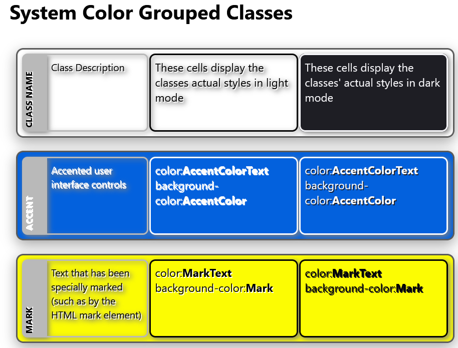
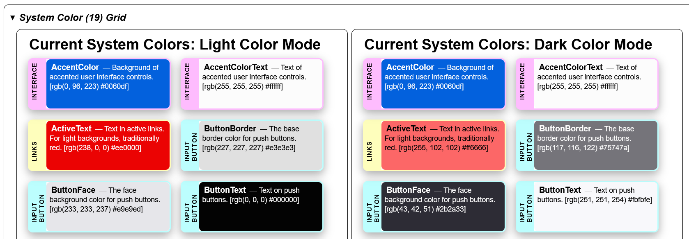
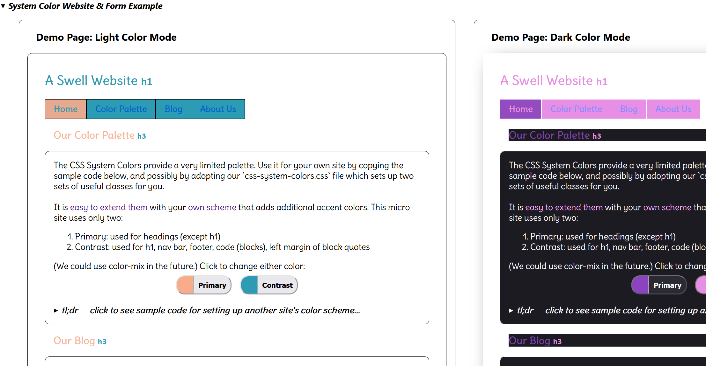

# CSS System Colors Visual Demonstration

CSS provides a system-wide color scheme, that automatically handles light & dark
modes, requires little effort to implement by web designers and is accessible &
user-friendly. System Colors are derived by the browser from the user&#39;s
operating system&#39;s color scheme.

Advantages of using system colors include:

- With just a few statements a website can handle light & dark modes.
- Application colors will match others providing a consistent user experience.
- They are designed to adapt to different light/dark modes and contrast
  settings.
- They are ideal for creating accessible and user-friendly interfaces.
- They can be used in combination with other color values to create a harmonious
  color palette.

This page provides a nice visual reference to the system-colors - but note that
the displayed colors are by design **specific to this browser/operating
System**!

> Avoid specifying different colors for
> [light or dark mode](https://developer.mozilla.org/en-US/docs/Web/CSS/color_value/light-dark):
> let the browser & OS handle it for you!

This page demonstrates the CSS System Colors in action.

## What the system specification doesn't/can't do

- Provide classes to readily access the suggested styles
- Provide a JSON representation of the colors
- Show the colors: not by color mode, by category, or as interpreted by the
  browser
- Provide explicit terms or names for the implicit categories or groups it
  creates
- Show how the color scheme can be used practically

## This web page addresses these pain points

- We provide an independent file 'css-system-colors.css' that sets up handy
  classes corresponding with the suggested styles
- The file 'css-system-json.js' provides two different JSON representations of
  the colors that can be adapted for your own use.
- A JSON file can be downloaded which contains the actual colors (in RGBA & hex
  format) for each color mode, as provided by the user's browser & operating
  system (OS).
- We provide 3 different views of the colors: by category, with different color
  modes implemented, and as actually displayed by the browser.
- The 'System Colors Categories' section provides categories that make
  conceptualizing the system colors easier and more natural. These match the
  classes in the 'css-system-colors.css' file.
- Provides a micro-website and minimal input form to explore how best to use the
  system colors.

## Screenshots

## License

©2024 eoc.online under the permissive MIT License. Please note our contributions
though!

<https://eoc.online>: Open source tooling for Emergency Operation Centers

Source & details at <https://github.com/eoconline/css-system-colors>
