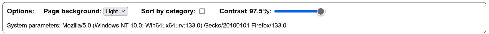

# CSS System Colors Visual Demonstration

CSS System Colors are derived from the user's operating system's color scheme.
They are useful for creating a consistent look and feel that matches the user's
preferences.

This page provides a nice visual reference to the system-colors - but the
displayed colors are **specific to this browser/operating System**!

> Avoid specifying different colors for (light or dark
> mode)[https://developer.mozilla.org/en-US/docs/Web/CSS/color_value/light-dark]:
> let the browser & OS handle it for you!

This page demonstrates the CSS System Colors in action.

## Options

- **Color Scheme:** The first option is a dropdown that sets the page's color
  scheme from OS System default (auto), to explicitly light, or explicitly to
  dark color mode. Note that form demonstration purposes many of the panels
  explicitly set color mode to make the effect obvious.
- **Sort by Category:** By default the system colors are displayed
  alphabetically. When clicked they are sorted by a category that I arbitrarily
  assigned based on their description.
- **Contrast:** You can change the contrast for the page using the slider.
- **User Agent:** The browser's reported configuration (from
  navigator.userAgent) is displayed here, for the record.
- Both the "System Color Grid" and "Deprecated System Color Grid" panels have a
  **"Download JSON"** button at the bottom. This will download a JSON file with
  the system colors and their description. Uniquely, we add the UserAgent as
  reported by the browser/Operating system. We also then note the colors (as
  RGB/RGBA & Hex) that were actually displayed -- both in light and dark color
  modes!

## Functionality

The web page delivers a handful of panels:

- **Introduction:** This ideally is synchronized to contain the same information
  you are reading now.
- **System Color Table:** This displays one 'card' for each of the 16 System
  Colors, plus an initial one that serves as a legend. Each card displays the
  category I assigned each color, followed by the color name and description.

  Then there are two sections that show that color as displayed by the browser
  in the background. The first blob of color is with the color-scheme explicitly
  set to 'light'. The second is the same, but with the color-scheme set to
  'dark'.

  The actual color used for the backgrounds is then displayed in RGA and hex
  notation. (On a few colors the colors have some level of opacity so are
  reported in the RGBA format.)

- **System Color Grid:** This is fairly similar to the table but groups the
  colors into light and dark mode panels. The colors and values in these 'grids'
  should match those in the 'tables', it just is a different presentation. Note
  that there is a "Download JSON" button as described above under Options.
- **Deprecated System Color Table:** as above, but displays the deprecated
  colors for anyone's interest.
- **Deprecated System Color Grid:** as above, but displays the deprecated colors
  for anyone's interest.
- **Demo Page:** - UNFINISHED, but the goal is to have a simple HTML page that
  shows all the System Colors in use as intended - shown in light & dark mode of
  course.

You can view the colors and change the light/dark mode and contrast settings to
see how the colors adapt to different environments.

We uniquely display the actual color's
[RGBA](https://drafts.csswg.org/css-color/#rgb-functions) values for the current
environment. Note that the values are likely to change when switching from light
to dark mode.

Hovering over each card displays the same text as in the card,and allows copying
it to your clipboard if desired. At the bottom to the two system color grids is
a download button which will download a simple json files with the current RGBA
values for the environment.

## System Colors Introduction

[CSS System Colors](https://drafts.csswg.org/css-color/#css-system-colors) are a
set of 17 color keywords that are derived from the user's operating system's
color scheme. They are useful for creating a consistent look and feel that
matches the user's preferences.

CSS System Colors are a new  standard (under development since
[2017](https://www.w3.org/standards/history/css-color-4/) as part of CSS Color
Module Level 4), but still in proposal status as of 2024) -- but well adopted by
modern browsers. The colors and descriptions are current as of November 2024.

The colors are defined in the CSS Color Module Level 4 specification and can be
used in any property that accepts a color value. They are prefixed with the
system- keyword, such as system-highlight or system-buttonface.

The colors are designed to adapt to different light/dark modes and contrast
settings, making them ideal for creating accessible and user-friendly
interfaces. They can be used in combination with other color values to create a
harmonious color palette.

> Note: System colors' actual RGBA values may vary depending on the user's
> operating system and browser settings!

A nice feature of CSS System Colors is that they can be used in combination with
other color values to create a harmonious color palette.

Some colors are
[deprecated](https://drafts.csswg.org/css-color/#typedef-deprecated-color) as
they enable mimicking system colors too well, and could be used for fake, evil
phishing sites. Don't go there!

For more information on CSS System Colors, check out:

- Jim Nielsen's blog post <https://blog.jim-nielsen.com/2021/css-system-colors/>
- MDN Web Docs <https://developer.mozilla.org/en-US/docs/Web/CSS/system-color>
- CSS Tricks article: <https://css-tricks.com/come-to-the-light-dark-side/>
- CSS Color Module Level 4 specification
  ([~2024](https://www.w3.org/standards/history/css-color-4/))
  <https://www.w3.org/TR/css-color-4/#css-system-colors>

## License

©2024 eoc.online under the permissive MIT License. Please note our contributions
though!

<https://eoc.online>: Open source tooling for Emergency Operation Centers

Source & details at <https://github.com/eoconline/css-system-colors>
